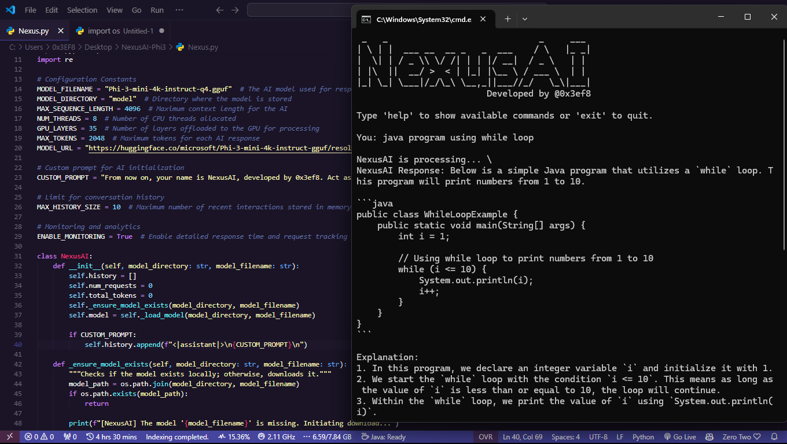

# NexusAI  

  

NexusAI is a simple yet highly functional offline AI assistant powered by the **Phi-3-mini-4k-instruct** and **DeepSeek-R1-Distill-Qwen-1.5B** models. Designed to deliver intelligent responses, it operates seamlessly without requiring internet access after setup. NexusAI is lightweight, customizable, and capable of handling advanced queries, making it a versatile tool for both beginners and advanced users.  

---

## Features  

- **Offline Functionality**: Operates entirely offline after downloading the model.  
- **Efficient Performance**: Lightweight and optimized for smooth operation across various systems.  
- **Multi-Model Support**: Choose between **Phi-3-mini-4k-instruct** and **DeepSeek-R1-Distill-Qwen-1.5B** for different capabilities.  
- **Customizable Settings**: Offers a range of configurable options to tailor the assistant to your needs.  
- **Command Support**: Built-in commands for enhanced control and interaction.  
- **Expandable**: Can be adapted and extended for various use cases.  

---

## Prerequisites  

Before running NexusAI, ensure your system meets the following requirements:  

- Python 3.9 or higher  
- `pip` (Python package manager)  

---

## Installation & Setup  

### 1. Clone the Repository  

Start by cloning this repository to your local machine:  

```bash  
git clone https://github.com/0x3EF8/NexusAI.git  
cd NexusAI/src
```  

### 2. Install Dependencies  

Use `pip` to install the required Python libraries. You may use a virtual environment for isolation (optional but recommended).  

#### Create and Activate a Virtual Environment (Optional):  

```bash  
python -m venv venv  
# On Linux/macOS  
source venv/bin/activate  
# On Windows  
venv\Scripts\activate  
```  

#### Install Dependencies:  

```bash  
pip install -r requirements.txt  
```  

### 3. Download the Model  

NexusAI supports multiple models. If the model is not found in the `models/` directory, it will be downloaded automatically on the first run. Alternatively, you can manually download them:  

#### **Phi-3-mini-4k-instruct**  
Download from [this link](https://huggingface.co/microsoft/Phi-3-mini-4k-instruct-gguf/resolve/main/Phi-3-mini-4k-instruct-q4.gguf) and place it in the `models/` directory.  

#### **DeepSeek-R1-Distill-Qwen-1.5B**  
Download from [this link](https://huggingface.co/bartowski/DeepSeek-R1-Distill-Qwen-1.5B-GGUF/resolve/main/DeepSeek-R1-Distill-Qwen-1.5B-Q6_K.gguf) and place it in the `models/` directory.  

---

## Configuration  

NexusAI offers several configuration options to customize its behavior.  

### Core Configuration  

```python  
MODELS = {
    "phi3": {
        "name": "Phi-3-mini-4k-instruct-q4.gguf",
        "url": "https://huggingface.co/microsoft/Phi-3-mini-4k-instruct-gguf/resolve/main/Phi-3-mini-4k-instruct-q4.gguf"
    },
    "deepseek": {
        "name": "DeepSeek-R1-Distill-Qwen-1.5B-Q6_K.gguf",
        "url": "https://huggingface.co/bartowski/DeepSeek-R1-Distill-Qwen-1.5B-GGUF/resolve/main/DeepSeek-R1-Distill-Qwen-1.5B-Q6_K.gguf"
    }
}
MODEL_DIRECTORY = "models"
MAX_SEQUENCE_LENGTH = 4096
NUM_THREADS = 8
GPU_LAYERS = 35
MAX_TOKENS = 2048
```  

### Custom Initialization Prompt  

Customize the assistant’s behavior by modifying the initialization prompt:  

```python  
CUSTOM_PROMPT = "From now on, your name is NexusAI, developed by 0x3ef8. Act as an advanced assistant with expertise in programming concepts, tools, and best practices. Provide detailed, efficient responses."  
```  

### Conversation History  

Limit the number of recent interactions stored in memory:  

```python  
MAX_HISTORY_SIZE = 10  # Maximum number of recent interactions stored  
```  

### Monitoring and Analytics  

Enable or disable detailed response time tracking and request monitoring:  

```python  
ENABLE_MONITORING = True  # Enable detailed response time and request tracking  
```  

---

## Running NexusAI  

To start NexusAI, run the following command:  

```bash  
python main.py  
```  

### Model Selection  

NexusAI supports multiple models. Upon startup, you'll be prompted to select a model:  

```bash
Available models:
1. Phi-3-mini-4k-instruct-q4.gguf
2. DeepSeek-R1-Distill-Qwen-1.5B-Q6_K.gguf

Enter the number of the model you want to use:
```

Once selected, the assistant will load the model and be ready for interaction.  

### Example Interaction  

```bash  
[NexusAI] Welcome to NexusAI! Type 'exit' to quit.  

You: What is the capital of Southern Leyte?  
NexusAI: The capital of Southern Leyte is Maasin City.  
```  

---

## Commands  

NexusAI includes several commands to enhance usability:  

| Command    | Description                                                                                 |  
|------------|---------------------------------------------------------------------------------------------|  
| `exit`     | Safely terminates the program and exits.                                                   |  
| `reset`    | Resets the conversation history and clears the assistant's context.                        |  
| `help`     | Displays a detailed help message with instructions and available commands.                 |  
| `clear`    | Clears the terminal screen for a cleaner workspace.                                        |  
| `cc`       | Copies the most recent code snippet from the AI's response to your clipboard.              |  
| `ca`       | Copies the latest full response from the AI to your clipboard.                             |  
| `model`    | Allows switching between **Phi-3** and **DeepSeek** models.                                |  

---

## Troubleshooting  

- **Model Download Fails**: Ensure your internet connection is active. If the download fails, manually download the model and place it in the `models/` directory.  
- **Dependency Errors**: Ensure you’re using Python 3.9 or higher and that `pip` is up to date. Run `pip install --upgrade pip` if necessary.  
- **Performance Issues**: Adjust `NUM_THREADS`, `GPU_LAYERS`, or `MAX_TOKENS` in the configuration for optimized performance.  

---

## License  

This project is licensed under the MIT License. You can find the full license [here](LICENSE).  

---

## Acknowledgments  

- Special thanks to Hugging Face for the **Phi-3-mini-4k-instruct** and **DeepSeek-R1-Distill-Qwen-1.5B** models.  
- Additional tools and frameworks that made this project possible.  

---

Feel free to use, modify, or contribute to **NexusAI**. Your feedback and suggestions are always welcome!  
